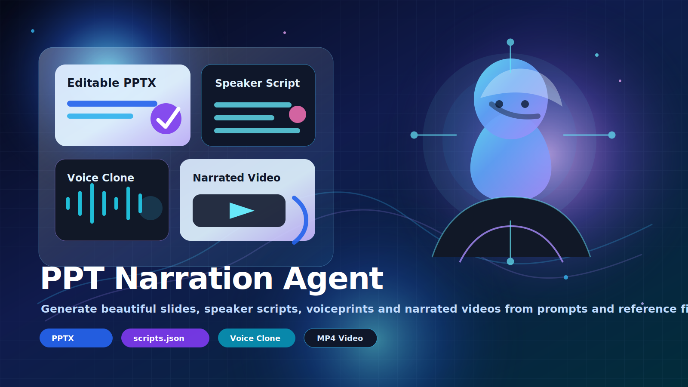
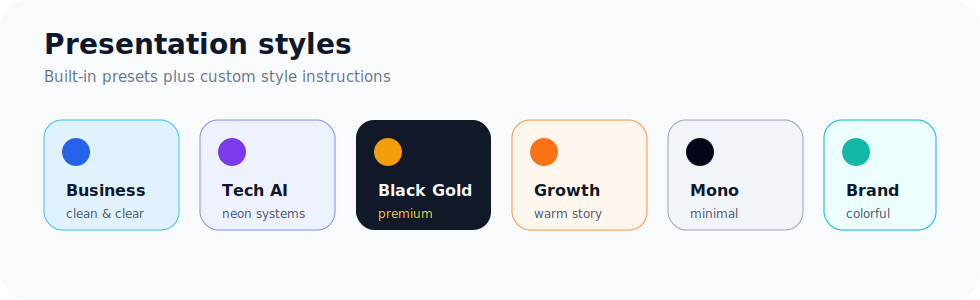
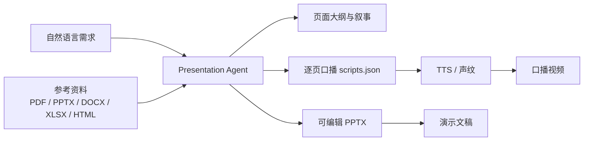

# PPT Narration Agent｜口播 PPT Agent 工作台

一个面向内容创作、方案汇报和产品演示的本地 Web 工作台。它可以根据自然语言和参考资料生成图文并茂的可编辑 PPT，同时输出逐页口播稿，并支持声纹提取、PDF 切图和口播视频合成。

<p align="center">
  
</p>

## 核心能力

- **Agent 生成 PPT**：输入一句需求或上传参考文件，自动生成结构化 PPTX。
- **逐页口播稿**：每页同步生成 `scripts.json`，可直接用于配音或视频合成。
- **图文并茂版式**：内置封面、流程图、架构图、对比页、指标卡、时间线、总结页等布局。
- **风格可控**：提供商务简洁、科技 AI、高端黑金、温暖增长、极简黑白、活力品牌等预设，也支持自定义风格说明。
- **OpenAI 兼容 LLM**：Web 端配置 `base_url / model / api_key / headers / temperature / timeout`。
- **完整口播视频链路**：支持声纹提取、PDF 切图、图片序列 + 口播稿合成 MP4。



## 快速开始

```bash
git clone git@github.com:zhytest123/ppt-narration-agent.git
cd ppt-narration-agent/web_system
python3 -m pip install -r requirements.txt
python3 runtime/download_assets.py
./run.sh
```

默认访问：

```text
http://127.0.0.1:8000
```

> 只体验“Agent 生成 PPT + 口播稿”时，可以先跳过 `python3 runtime/download_assets.py`。声纹提取和视频合成需要下载运行时模型资产。

## 工作流



## Web 模块

| 模块 | 输入 | 输出 | 说明 |
| --- | --- | --- | --- |
| Agent PPT | 自然语言、参考文件、LLM 配置、风格预设 | PPTX、口播稿、ZIP | 用于从需求或资料快速生成演示稿 |
| 声纹提取 | m4a / mp3 / wav / flac 等音频 | `.pt` 声纹文件 | 用于后续 TTS 声音克隆 |
| PDF 切图 | PDF 文件 | 页面图片 ZIP | 将已有文档转成视频素材 |
| 视频合成 | 图片序列、`scripts.json`、声纹 | MP4 视频 | 自动逐页配音并拼接口播视频 |

## 目录结构

```text
web_system/
├── backend/              # FastAPI 后端、Agent 生成链路、视频合成链路
├── frontend/             # 原生 Web 页面
├── templates/            # PPTX 稳定母版
├── runtime/              # TTS / 声纹运行时代码与模型下载清单
├── workspace/            # 本地任务、输出、声纹目录
├── requirements.txt
├── run.sh
└── README.md
```

## 运行时模型

声纹提取、TTS 和视频合成会使用 ChatTTS 与 OpenVoice 模型。首次使用这些能力前运行：

```bash
cd web_system
python3 runtime/download_assets.py
```

下载脚本会根据 `web_system/runtime/assets_manifest.json` 将所需模型文件放到运行时目录。

模型与运行时参考：

- ChatTTS：`https://huggingface.co/2Noise/ChatTTS`
- OpenVoice：`https://huggingface.co/myshell-ai/OpenVoice`
- ChatTTS-OpenVoice：`https://github.com/HKoon/ChatTTS-OpenVoice`

## 文档

- 详细使用说明：`web_system/README.md`
- 运行时说明：`web_system/runtime/README.md`
- 资产清单：`web_system/runtime/assets_manifest.json`

## License

本项目包含对 ChatTTS / OpenVoice 运行方式的封装。使用和分发时请同时遵守相关上游项目及模型权重的许可证要求。
