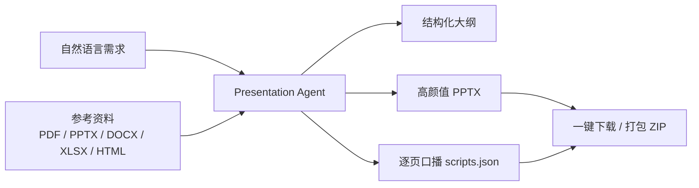
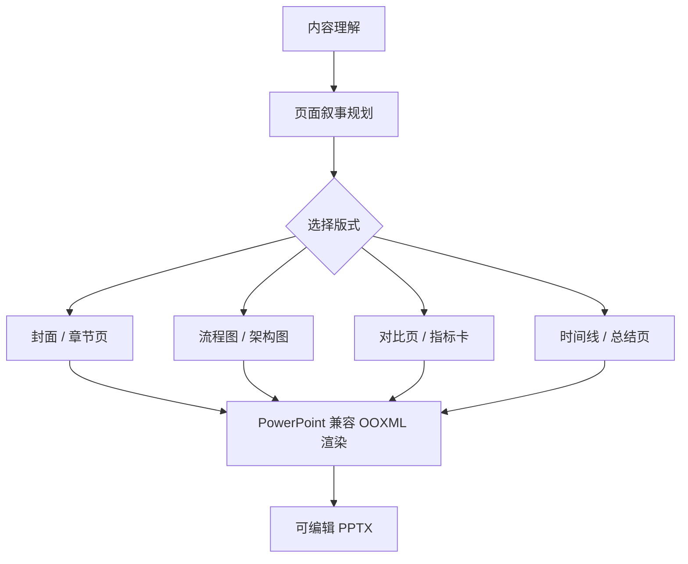

# 口播 PPT Agent 工作台

这是一个本地可运行的口播 PPT / 口播视频工具台。核心能力是：

- 通过自然语言或参考文件生成高颜值 PPTX
- 同步生成逐页口播文本 `scripts.json`
- Web 端配置 OpenAI 兼容 LLM 接口
- 支持 PPT 风格预设与自定义风格补充
- 支持声纹提取、PDF 切图、图片 + 口播稿合成视频

主应用在：

```text
web_system/
```

详细安装、启动和接口说明见：

```text
web_system/README.md
```

## 快速启动

```bash
cd web_system
python3 -m pip install -r requirements.txt
./run.sh
```

默认访问：

```text
http://127.0.0.1:8000
```

## 目录说明

```text
web_system/
├── backend/              # FastAPI 后端、Agent 生成链路、视频合成链路
├── frontend/             # 原生 Web 页面
├── templates/            # PPTX 稳定母版
├── runtime/              # TTS / 声纹运行时代码；大模型资产通过腾讯云 COS 下载
├── workspace/            # 本地任务、输出、声纹目录；默认不提交运行产物
├── requirements.txt
├── run.sh
└── README.md
```

## 功能预览

### Agent 生成 PPT 与口播稿



### 图文并茂 PPT 生成策略



### Web 工作台模块

| 模块 | 输入 | 输出 | 说明 |
| --- | --- | --- | --- |
| Agent PPT | 自然语言、参考文件、LLM 配置、风格预设 | PPTX、口播稿、ZIP | 支持科技 AI、商务简洁、黑金、高级品牌等风格 |
| 声纹提取 | m4a / mp3 / wav 等音频 | `.pt` 声纹文件 | 用于后续 TTS 克隆声音 |
| PDF 切图 | PDF 文件 | 页面图片 ZIP | 方便把已有材料转成视频素材 |
| 视频合成 | 图片序列、`scripts.json`、声纹 | MP4 视频 | 自动逐页 TTS 并拼接口播视频 |

## GitHub 上传注意事项

本仓库按“源码 + 运行时代码 + 外置大资产”方案上传：

- GitHub 存放 Web 工作台源码、Agent 生成逻辑、TTS/OpenVoice 运行时代码、PPT 模板和文档
- 腾讯云 COS 存放大模型权重、默认声纹等大文件
- `web_system/runtime/assets_manifest.json` 记录所有需要外置存储的文件路径、大小和 SHA256
- `web_system/runtime/download_assets.py` 用于在回填 COS 链接后一键下载资产
- 工作区任务产物、输出视频、临时音频和缓存不提交

拿到 COS 链接后，把 `assets_manifest.json` 中每项 `cos_url` 补齐，然后运行：

```bash
cd web_system/runtime
python3 download_assets.py
```

## 当前状态

项目已清理本地缓存和运行产物，并保留必要目录占位文件：

- `web_system/workspace/jobs/.gitkeep`
- `web_system/workspace/outputs/.gitkeep`
- `web_system/workspace/voiceprints/.gitkeep`
